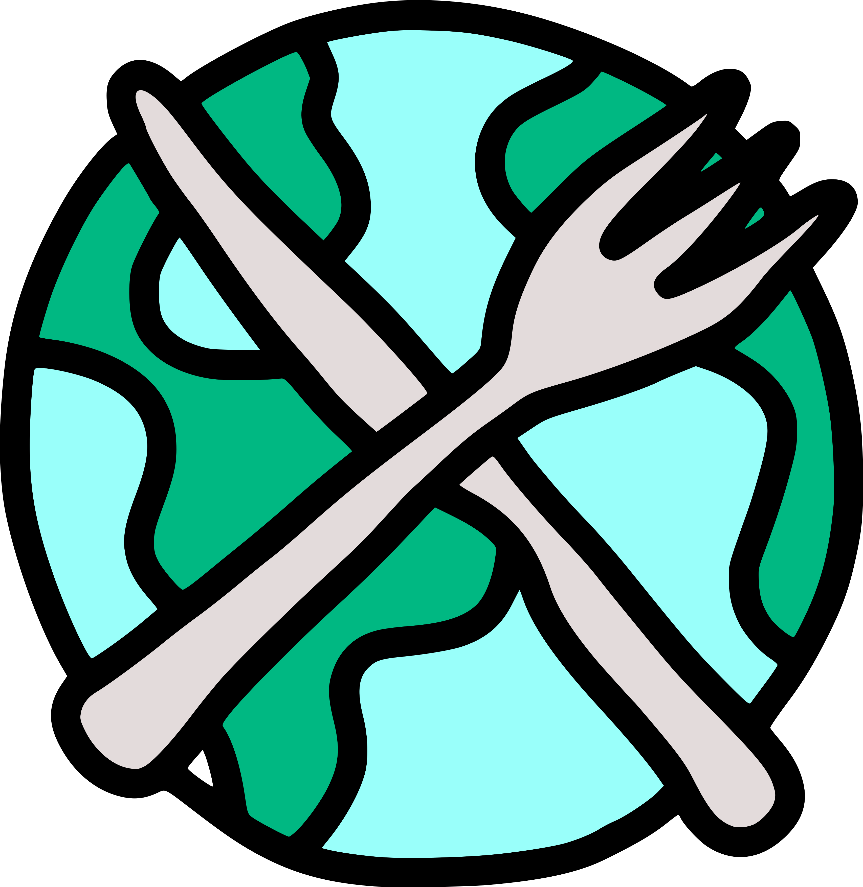

[![Contributors][contributors-shield]][contributors-url]
[![Forks][forks-shield]][forks-url]
[![Stargazers][stars-shield]][stars-url]
[![Issues][issues-shield]][issues-url]
[![MIT License][license-shield]][license-url]

  

  <h3 align="center">Mundo da cozinha</h3>

  

    Bem-vindo(a) ao nosso blog!
    Aqui, você encontrará um  
    mundo delicioso de sabores,
    texturas e aromas.  
     
    <a href="https://github.com/othneildrew/Best-README-Template"><strong>Explore the docs »</strong></a>
     
     
    <a href="https://github.com/othneildrew/Best-README-Template">View Demo</a>
    ·
    <a href="https://github.com/othneildrew/Best-README-Template/issues">Report Bug</a>
    ·
    <a href="https://github.com/othneildrew/Best-README-Template/issues">Request Feature</a>
  

## Sobre o blog Mundo Da Cozinha

  

 

### Propósito do blog

Blog foi concebido com o propósito de compartilhar experiências culinárias e deliciosas receitas. Aqui, compartilhamos artigos que abordam uma variedade de tópicos relacionados à gastronomia e ao cozinhar em geral. Nossa marca e nossas postagens não são de forma forma forma alguma influenciadas por preferências culinárias específicas ou tendências alimentares.

### Como ele é feito?

Este blog utiliza uma plataforma avançada e foi projetado para ser acessível por qualquer tipo de dispositivo. Foi construído com foco na praticidade e em proporcionar uma experiência positiva para o usuário busca por receitas. Nossas receitas são elaboradas manualmente. Acreditamos que as instruções e dicas compartilhadas aqui devem ser claras e de fácil execução para cozinheiros de todos os níveis e para qualquer pessoa interessada em explorar o mundo da culinária.

### Nosso Objetivo

Nosso compromisso se estende à qualidade do conteúdo publicado. constantemente aprimorando nossas receitas e compartilhando truques culinários para manter nossos leitores inspirados na cozinha. Compartilhando conhecimento de forma transparente, estamos contribuindo para a promoção da culinária e incentivando pessoas de todos os níveis a se aventurarem na cozinha com confiança e entusiasmo. Agradecemos a você por fazer parte dessa jornada e esperamos que encontre nosso blog uma fonte valiosa de inspiração culinária.

Acesse https://www.mundodacozinha.com.br experimente e navegue você mesmo.

[product-screenshot]: public/game-print.jpeg

[contributors-shield]: https://img.shields.io/github/contributors/raphaelnsilva/secretword.svg?style=for-the-badge
[contributors-url]: https://github.com/raphaelnsilva/secretword/graphs/contributors
[forks-shield]: https://img.shields.io/github/forks/raphaelnsilva/secretword.svg?style=for-the-badge
[forks-url]: https://github.com/raphaelnsilva/secretword/network/members
[stars-shield]: https://img.shields.io/github/stars/raphaelnsilva/secretword.svg?style=for-the-badge
[stars-url]: https://github.com/raphaelnsilva/secretword/stargazers
[issues-shield]: https://img.shields.io/github/issues/raphaelnsilva/secretword.svg?style=for-the-badge
[issues-url]: https://github.com/raphaelnsilva/secretword/issues
[license-shield]: https://img.shields.io/github/license/raphaelnsilva/secretword.svg?style=for-the-badge
[license-url]: https://github.com/raphaelnsilva/secretword/blob/master/LICENSE.txt
